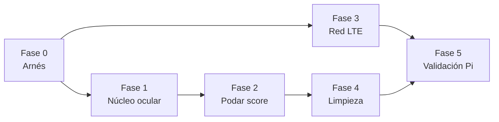

# Plan de trabajo: precisión, fiabilidad con lentes y comportamiento LTE

Referencia: [Driver Drowsiness Detection using MediaPipe (LearnOpenCV)](https://learnopencv.com/driver-drowsiness-detection-using-mediapipe-in-python/)

> **Estado (2026-07-26)**: Fases 1-4 implementadas en código. Pendiente lo que
> requiere hardware real: grabar los clips de la Fase 0 en la Pi, correr
> `tools/validate_video.py` sobre ellos, y la validación final de la Fase 5
> (sesión larga + prueba WiFi vs LTE).

## 1. Diagnóstico (por qué el de LearnOpenCV "funciona totalmente bien" y el nuestro no)

### 1.1 El proyecto de referencia es radicalmente simple

| Aspecto | LearnOpenCV | Nuestro sistema |
|---|---|---|
| Señal | EAR promedio de ambos ojos (mismos 6 landmarks que usamos) | EAR fusionado por yaw + 9 parámetros oculares |
| Umbral | Fijo: `EAR < 0.18` | `open_ref` adaptativo × escalas por noche/lentes × piso de baseline × histéresis doble |
| Disparo | Tiempo sostenido: `EAR < umbral` durante `>= 1.0 s` → alarma | Score 0-100 alimentado por ~20 fuentes de eventos (ojos, boca, cabeza, facial, manos, contexto, reglas, corroboración) |
| Calibración | Ninguna | 5 minutos |
| Estado | 3 variables (`start_time`, `DROWSY_TIME`, `play_alarm`) | Cientos (deques, histéresis, memorias, decays, ~30 variables de entorno) |

La robustez con lentes del proyecto de referencia NO viene de un truco especial: viene de que MediaPipe FaceMesh con `refine_landmarks` es bueno con lentes, y de que **un cierre sostenido de 1 segundo es una señal casi imposible de falsear**. Un parpadeo, un reflejo en el lente o un frame ruidoso no duran 1 segundo. Nuestro sistema, en cambio, dispara eventos con umbrales finos sobre señales ruidosas (amplitud de parpadeo < 0.035, velocidad de reapertura < 0.12, fijación de mirada, asimetría facial...) y cada uno suma al score: el ruido se acumula en vez de cancelarse.

### 1.2 Causa raíz de los falsos positivos

- **Demasiadas fuentes de evento con peso**: `BLINK_AMPLITUDE`, `REOPEN_SPEED`, `IBI`, `BLINK_TC`, `FIXATION`, `FACIAL_ASYMMETRY`, manos, contexto circadiano... son métricas de investigación con umbrales poblacionales, no señales fiables por conductor con una cámara de Pi. Los comentarios del propio código documentan al menos 8 parches contra falsos positivos ya aplicados (arranque en frío de `BLINK_FB`, microsueño durante calibración, EAR por parpadeo normal, PERCLOS con cara girada...). Cada parche es un síntoma: la arquitectura genera falsos positivos por diseño.
- **Umbral de cierre sobre-adaptativo** ([parametros/ojos.py:105-121](parametros/ojos.py#L105-L121)): `open_ref` con envolvente asimétrica × `night_scale` × `glasses_scale` × piso de baseline. Con lentes, si `open_ref` se arrastra hacia arriba por reflejos, `close_thr` sube y detecta cierres falsos; si baja, no detecta cierres reales. El umbral correcto con lentes es uno **estable** calibrado una vez, no uno que se mueve.
- **Calibración de 5 minutos**: ventana enorme para contaminarse (bostezo, mirar el celular, sol en la cara) y durante la cual el sistema opera con umbrales a medio asentar.

### 1.3 Causa raíz del comportamiento distinto en LTE

La detección por visión no usa la red, así que la diferencia viene de efectos secundarios:

1. **Reloj de pared en toda la lógica temporal** ([main.py:858](main.py#L858) y todo el pipeline usa `time.time()`). La Raspberry Pi no tiene RTC: al arrancar, la hora es incorrecta hasta que NTP sincroniza. Con WiFi eso ocurre en segundos, antes de arrancar el sistema; con LTE el módem tarda, y NTP **salta el reloj en medio de la sesión**. Un salto de reloj corrompe TODO lo que mide tiempo: ventana PERCLOS de 60 s, calibración de 5 min, `eye_closed_ms` (un salto de +2 s = falso microsueño instantáneo), temporizadores de recuperación del score, ventanas del RuleEngine, IBI... Esta es la explicación más probable del "se comporta muy diferente en LTE".
2. **Flush de Supabase: hasta 200 peticiones HTTP secuenciales** ([storage/supabasesync.py:96-102](storage/supabasesync.py#L96-L102)), una por fila. Con latencia LTE (~300-800 ms/petición), un flush puede tardar minutos, la cola SQLite crece sin límite y el cierre (`stop()`) se cuelga.
3. **MQTT con QoS 1 en red intermitente**: paho reenvía todo lo pendiente al reconectar (ráfagas), y los reintentos de conexión TLS + DNS en LTE inestable dejan `connected=false` largos ratos.

### 1.4 Código muerto

`fatiga.py` (monolito legacy) y los 7 `somnolencia_*.py` que solo él importa (`ocular`, `params`, `head_pose`, `face_touch`, `facial`, `context`, `medical_emergency`) están muertos: nada del pipeline actual los usa. Solo `somnolencia_core.py` (EAR/MAR/pose) y `camera_setup.py` siguen vivos. También sobran `.venv.roto.bak/`, `test.py`, y los `.db-shm/.db-wal` versionados.

---

## 2. Plan por fases

### Fase 0 — Arnés de validación (antes de tocar nada)
> Sin medición, cada cambio es una apuesta. Esto convierte el resto del plan en algo verificable.

- [ ] Grabar 4-6 clips cortos con la cámara real de la Pi: con/sin lentes × día/noche × (ojos abiertos normal, microsueños simulados, cabeceo, hablar/bostezar). El sistema corre en vivo, así que la grabación sale del propio pipeline: `SOMNO_RECORD_VIDEO=1 ./run.sh` escribe el frame crudo (sin HUD) a `recordings/<session_id>.avi` mientras todo opera normal — el clip es exactamente lo que vio el detector.
- [ ] Extender `tools/validate_precision.py` para reproducir un video contra el pipeline y reportar: falsos positivos/min, latencia de detección de cierre sostenido, EAR crudo vs umbral en el tiempo.
- [ ] Criterio de éxito global: **0 alertas nivel ≥2 en clips de conducción normal (con lentes incluidos)** y **detección < 2 s en microsueños simulados**.

### Fase 1 — Núcleo ocular estilo LearnOpenCV (la fuente de verdad)
> Adoptar el mecanismo probado del artículo como señal primaria; todo lo demás pasa a ser secundario.

- [ ] **Detector de cierre sostenido simple**: `EAR_promedio < EAR_THRESH` acumulando `drowsy_time`; si `drowsy_time >= WAIT_TIME` (1.0-1.5 s) → alerta directa (esto ya existe como `EYE_CLOSED_MS` pero enterrado entre 9 parámetros; pasa a ser EL disparador principal).
- [ ] **Umbral estable, no adaptativo por frame**: `EAR_THRESH = 0.70 × ear_baseline` calibrado, congelado tras calibrar. Eliminar `open_ref` adaptativo, `night_close_scale`, `glasses_close_scale`, `glasses_perclos_floor_bonus`. Con lentes el baseline calibrado YA absorbe el offset de la montura; las escalas por modo son parches sobre el umbral móvil.
- [ ] **Calibración de 60-90 s** (mediana de EAR con ojo abierto, descartando percentil bajo por parpadeos) en vez de 5 min. Persistir por conductor como ahora (`CalibrationStore`).
- [ ] Mantener `refine_landmarks=1` siempre (clave para lentes); quitar el flag de entorno.
- [ ] Conservar la fusión por yaw ([somnolencia_core.py:60](somnolencia_core.py#L60)) y el gate `pose_reliable`: son de lo mejor del sistema actual (el artículo no maneja giro de cabeza y nosotros sí lo necesitamos).
- [ ] Verificar con el arnés: curva EAR con lentes debe quedar claramente separada del umbral (abierto ~0.28+, cerrado ~0.08-0.15).

### Fase 2 — Podar parámetros y simplificar el score
> Quitar lo innecesario: menos fuentes de evento = menos falsos positivos.

- [ ] **Quedan con peso en el score** (señales fuertes, validadas en literatura y robustas):
  - Cierre sostenido (Fase 1) — disparador principal.
  - `PERCLOS` P80 en 60 s — fatiga acumulada.
  - Bostezo (`MAR` sostenido ≥ ~2 s, no instantáneo).
  - Cabeceo (pitch sostenido vs neutro).
- [ ] **Se degradan a telemetría sin peso** (se publican, no alertan): `BLINK_TC`, `BLINK_FB`, `IBI`, `BLINK_AMPLITUDE`, `REOPEN_SPEED`, `FIXATION`, asimetría facial, manos-en-cara, contexto circadiano.
- [ ] Simplificar `DynamicFatigueScore`: al reducir las entradas a 4, gran parte de la maquinaria defensiva (`restored_requires_fresh_event`, cap de restauración, rise_gain...) puede encogerse. Revisar qué knobs de entorno quedan realmente en uso y borrar el resto.
- [ ] Evaluar `RuleEngine` y `corroboration.py` contra el arnés: si con 4 señales limpias no aportan, simplificar o eliminar. El `emergencydetector` médico se conserva (pipeline independiente, requisito del proyecto).

### Fase 3 — Robustez de red (LTE = WiFi)
> El pipeline de visión no debe enterarse de en qué red está.

- [ ] **Reloj monotónico para TODA la lógica interna**: ventanas, duraciones, calibración, recovery, RuleEngine usan `time.monotonic()`; `time.time()` queda solo en el borde (timestamps para MQTT/Supabase). Esto elimina de raíz el efecto del salto NTP en LTE. Es el cambio más grande de la fase (toca `main.py`, `parametros/`, `engine/`) pero es mecánico.
- [ ] **Supabase por lotes**: agrupar filas por tabla y hacer 1 insert con lista (hasta 200 filas = 1-3 peticiones en vez de 200). Cap de cola SQLite (p.ej. 50k filas, descartando telemetría vieja pero nunca eventos/emergencias) + `VACUUM`/prune periódico.
- [ ] **MQTT**: `max_inflight_messages_set` bajo, QoS 0 para telemetría periódica / QoS 1 solo para alertas y emergencias, `socket timeout` explícito. Log del estado de red en la telemetría (`connected`, `queue_size`) para diagnosticar desde el panel.
- [ ] Probar con el arnés de red: simular LTE con `tc netem` (latencia 400 ms, 5% pérdida) o compartiendo datos del celular, y verificar que score/alertas son idénticos a WiFi.

### Fase 4 — Limpieza de código muerto
- [ ] Borrar: `fatiga.py`, `somnolencia_ocular.py`, `somnolencia_params.py`, `somnolencia_head_pose.py`, `somnolencia_face_touch.py`, `somnolencia_facial.py`, `somnolencia_context.py`, `somnolencia_medical_emergency.py`, `test.py`, `.venv.roto.bak/`.
- [ ] `.gitignore`: `somnolencia_queue.db*`, `__pycache__`, `.DS_Store`, `recordings/`.
- [ ] Mover las funciones vivas de `somnolencia_core.py` a `core/` (p.ej. `core/vision.py`) para que la raíz quede limpia; `camera_setup.py` puede quedarse o moverse a `core/`.
- [ ] Actualizar `CLAUDE.md` con la arquitectura resultante.

### Fase 5 — Validación final en la Pi
- [ ] Repetir la batería de la Fase 0 en hardware real: con/sin lentes, día/noche, WiFi/LTE.
- [ ] Sesión larga (30+ min) de conducción normal: 0 falsos positivos nivel ≥2.
- [ ] Documentar los umbrales finales y el protocolo de prueba en `docs/`.

## 3. Orden y dependencias

La Fase 3 (red) es independiente de las de visión y puede avanzar en paralelo. La limpieza (F4) va al final para no borrar nada que las fases anteriores aún quieran consultar como referencia.
